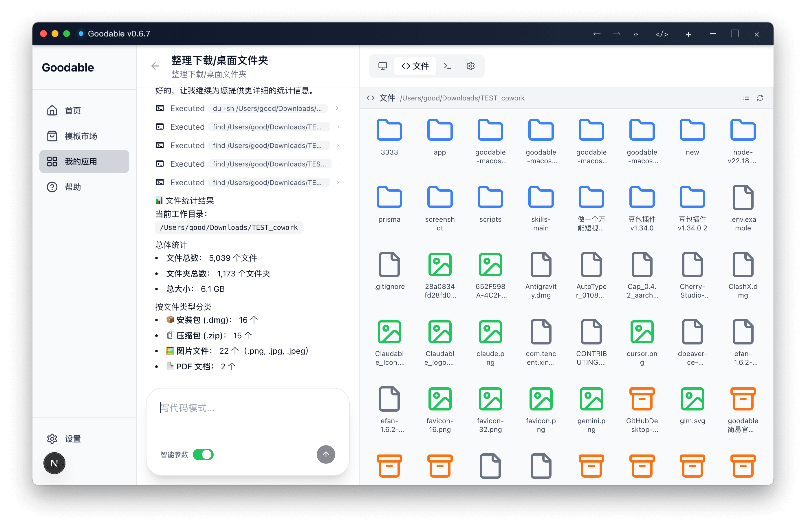
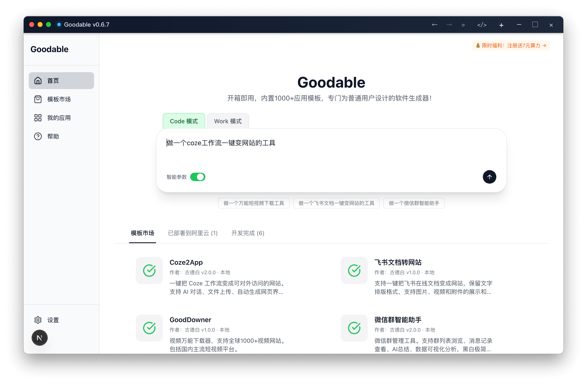
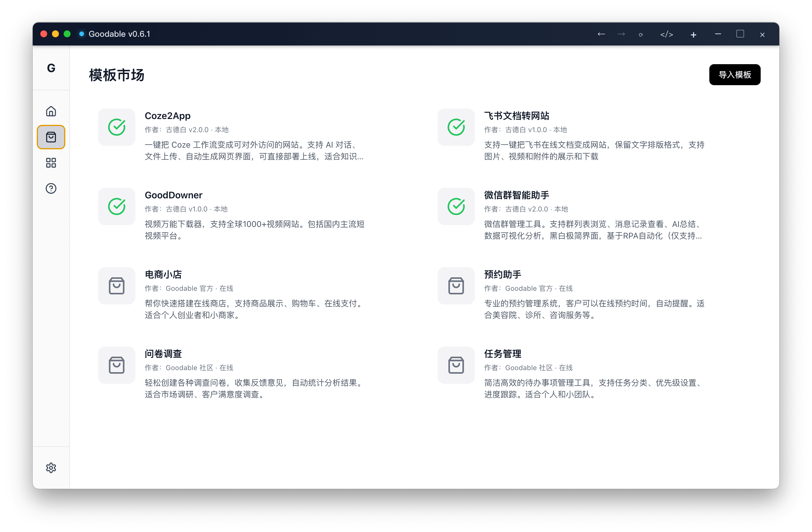
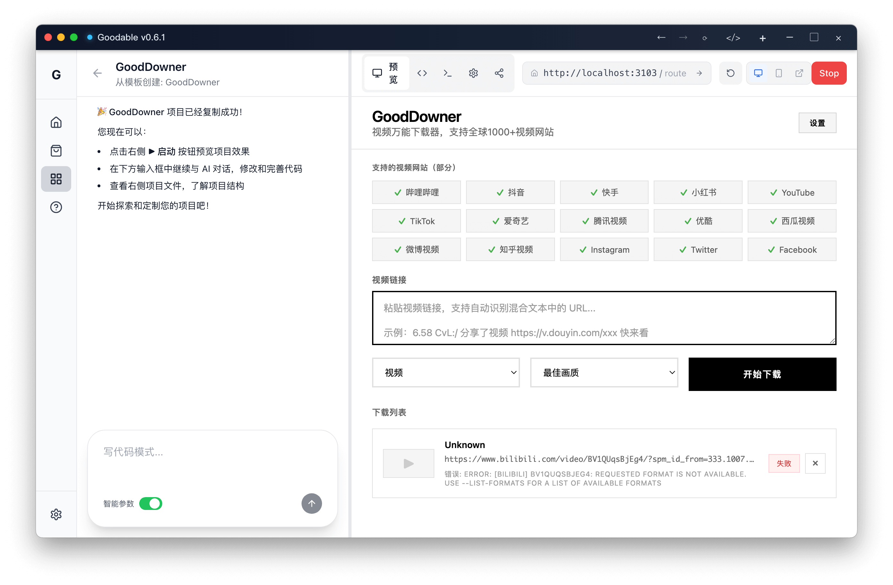
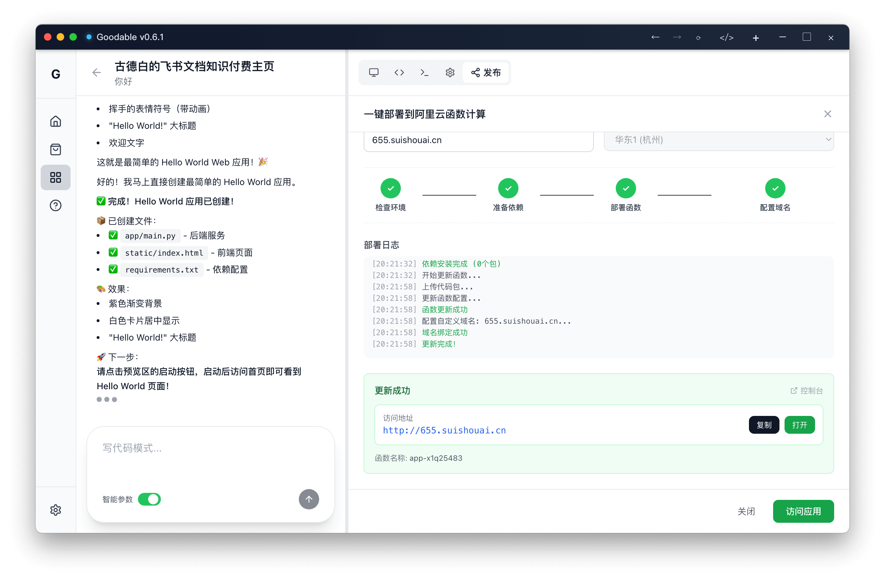

<div align="center">
  
  <h1>Goodable</h1>

  <p>
    <a href="README.md">中文</a> | <b>English</b>
  </p>

  <p>
    <b>Desktop AI Agent</b> for non-technical users: <b>Code / Work Dual Mode</b> (Out of the box: Built-in Node.js + Python runtime), integrated with ClaudeAgent SDK, featuring high-quality templates and one-click deployment.
  </p>

  <p>
    <b>Whether you're a non-technical user, as long as you can type and click, you can start with templates or folder tasks to deliver production-ready websites, tools, and tangible results.</b>
  </p>

  <p>
    <a href="https://goodable.cn">goodable.cn</a> ·
    <a href="https://github.com/ImGoodBai/goodable/releases">Releases</a> ·
    <a href="https://github.com/ImGoodBai/goodable/issues">Issues</a>
  </p>

  <p>
    
    
    
  </p>
</div>

---

## Work Mode (Cowork-style): Local File Workflows

**Work Mode brings Cowork-style workflows to your desktop: Authorize folder → Plan → Execute → Progress report.**

Think of it as: letting AI handle complete workflows of "organizing, extracting, and generating deliverables" within your selected folders.

**4 Built-in Work Skills Templates:**
- ✅ **Local Folder Organization**: Archive by rules, batch rename, generate structured directories
- ✅ **Financial Invoice / Expense Reports**: Extract fields from files/images/text, generate expense reports and summary tables
- ✅ **Contract Organization**: Batch process contracts, extract key terms and clauses, output lists and summaries
- ✅ **HR Resume Processing**: Batch organize resumes, extract candidate information, output structured tables and screening results

We've added commonly used Skills for office scenarios and are continuously expanding the library.

**Download the latest release to try Work Mode now!**

| macOS (Apple Silicon) | macOS (Intel) | Windows |
|---|---|---|
| [⬇️ Download](https://github.com/ImGoodBai/goodable/releases/latest) | [⬇️ Download](https://github.com/ImGoodBai/goodable/releases/latest) | [⬇️ Download](https://github.com/ImGoodBai/goodable/releases/latest) |



*Note: Not affiliated with Anthropic.*

---

## What is Goodable?

Goodable is an "AI toolbox for everyday people", with the core goal of turning "using AI" into "delivering results".

Think of it as: **A continuously evolving template marketplace + powerful generation/transformation capabilities + one-click deployment** — capable of both AI-powered application delivery and office workflow delivery.



---

## Positioning & Comparison

Goodable takes the "desktop delivery" route: supporting both code delivery and office workflow delivery.

- **Professional IDE/coding assistants for developers** (Cursor, TRAE, Qoder, Claude Code): Powerful and flexible, but typically require handling development environments, dependencies, and project structures — higher barrier for non-developers.
- **Web-based AI tools** (Coze, Manus, Lovable, Base44, etc.): Strong at "click and get pages", but limited by browser sandboxing — restricted local resource access, deep engineering capabilities, and self-hosting options.
- **Cowork-style workflow tools**: Emphasize "file organization and information extraction within authorized directories". Goodable's **Work Mode** draws inspiration from this paradigm while providing cross-platform desktop capabilities integrated with template delivery and one-click deployment.
- **Goodable (our positioning)**: Out of the box + local desktop + Code / Work dual mode + template delivery + one-click deployment. Lowers the barrier for non-technical users while preserving engineering depth and self-hosting options for advanced users.

---

## What Can You Do With It?

### Code Mode (Application Delivery)
- **Turn Coze workflows into websites** (coze2app)
- **Turn Feishu documents into websites** (Feishu Doc → Web)
- **One-click deployment to Alibaba Cloud + domain binding** (launch an accessible website in two minutes)
- **Universal short video downloader** (covers major Chinese platforms)
- **WeChat group assistant bot** and other common business templates
- Plus: continuously updated library of production-ready source code templates

### Work Mode (Office Workflows / Cowork-style)
- Local folder organization, archiving, batch renaming, directory listing
- Financial receipts/invoices/expense material extraction and summarization
- Contract batch processing and information extraction (lists/summaries/structured fields)
- HR resume batch processing and screening (structured tables/filtering results)
- (Continuously expanding) More office workflow Skills templates

---

## Core Features (Designed for Non-Technical Users)

- **Out of the box**: Built-in Node.js + Python runtime — no environment setup required
- **Dual Mode**: Code Mode for engineering delivery; Work Mode for local file workflow delivery
- **Stronger generation/transformation**: Integrated **ClaudeAgent SDK**, suitable for real-world task generation, transformation, and maintenance
- **Template marketplace**: One-click template import; continuous updates and new template releases
- **One-click deployment**: Alibaba Cloud deployment + domain binding — turn "running locally" into "online and accessible"
- **Engineering-grade**: Templates are not demos but production-ready skeletons for customization and delivery

<details>
<summary><b>Engineering & Core Architecture (For Technical Users)</b></summary>

- **ClaudeAgent SDK**: Streaming output, controllable sessions and tool invocations
- **Multiple concurrent projects**: Task queue, concurrent scheduling, process-level isolation
- **Stability**: Process synchronization locks, re-entry protection, exception recovery
- **Multi-instance capability**: Multi-window/multi-workspace parallel operation
- **IDE-like interface**: Chat + file tree + console + preview (similar to Manus multi-view)
- **Plan mode**: Plan first, execute later (extensible to multi-agent orchestration)
- **Progress visualization**: Task steps, state transitions, real-time display
- **Self-hosting**: Controllable source code, local data/runtime, deployable on-premises or in enterprise intranet
- **Web-enabled**: Same capabilities can be exposed as Web services or APIs (for developer-oriented use cases)

</details>

---

## Screenshot Preview

| Template Marketplace | Work Mode Workspace |
|---|---|
|  |  |

| Universal Video Downloader | Alibaba Cloud Deployment |
|---|---|
|  |  |

---

## How to Use

### Regular Users: Get Started in 3 Steps

1. Download and install the package for your platform → Run → Import a template or select a Work Mode folder task → Run/Deploy

> One-click installer — no need to configure Python or Node.js locally.

| macOS (Apple Silicon) | macOS (Intel) | Windows |
|---|---|---|
| [⬇️ Download](https://github.com/ImGoodBai/goodable/releases/latest) | [⬇️ Download](https://github.com/ImGoodBai/goodable/releases/latest) | [⬇️ Download](https://github.com/ImGoodBai/goodable/releases/latest) |

**Note**: Enter the Release page and select the installer for your platform.

---

### Developers: Customization and Extension

**Run from source**:
```bash
git clone https://github.com/ImGoodBai/goodable.git
cd goodable
npm install
npm run dev:electron
```

**Advanced capabilities**:

* On-premises / intranet deployment
* Expose desktop capabilities as Web services (provide externally via API)
* Custom templates / publish your own templates
* Integrate with enterprise workflows (CI, intranet gateway, permissions)

---

## Templates & Capability List

### Built-in Code Templates

* ✅ **coze2app**: Turn Coze workflows into websites with one click
* ✅ **Feishu Doc → Web**: Turn Feishu documents into websites with one click
* ✅ **Universal short video downloader**: Support major Chinese platforms
* ✅ **WeChat group assistant bot**: Common business skeleton template

### Built-in Work Skills (Office Workflow Templates)

* ✅ Local folder organization
* ✅ Financial invoice / expense report generation
* ✅ Contract organization
* ✅ HR resume processing

### More Templates Coming Soon

* 🔲 WeChat Official Account / Xiaohongshu content assistant (collect/rewrite/publish workflows)
* 🔲 E-commerce product selection and listing assistant
* 🔲 Enterprise knowledge base Q&A site (self-hosted)
* 🔲 Recruitment / resume screening assistant (comprehensive workflow version)
* 🔲 Contract / tender generation and review assistant (comprehensive workflow version)
* 🔲 Customer service ticket automation assistant
* 🔲 Automated data collection and cleaning tool
* 🔲 Marketing copy generation and A/B testing assistant
* 🔲 Meeting minutes automatic organization and distribution tool
* 🔲 Multi-platform content synchronization and management tool

> Support one-click import + continuous updates for new templates

---

## Roadmap

> One direction: turning "ordinary people using AI" from writing code into "continuously delivering applications and results".

* **More one-click deployments**

  * One-click deploy to: WeChat Mini Program / Alipay Mini Program / Douyin Mini Program / Quick App (planned)
  * One-click generate and deploy: Android / iOS apps (planned)

* **Stronger "clone/refactor" capabilities**

  * One-click clone any website (inspired by open-lovable's experience, but more "production engineering" oriented)
  * Upgrade from "clone UI" to "clone product capability + data structure + deployment architecture"

* **Template marketplace upgrade**

  * Support user-published templates (distribution, ratings, versioning, changelogs)
  * Template marketplace reaches **100 production-ready applications** (corresponding to "100agent" initiative: continuously develop/open source 100 agent/application templates)

* **Better non-technical experience**

  * "One-click complete environment/keys/deployment" guided wizard
  * Built-in diagnostics and repair (port conflicts, dependencies, permissions, deployment failure auto-detection)

* **Work Mode enhancements (Cowork-style)**

  * Continuously expand common office Skills (receipts/contracts/HR/material organization/meetings, etc.)
  * Stronger preview and thumbnail views (image/PDF/Office quick preview)
  * Task logs and rollback (avoid accidental operations)
  * Permissions and safety gates (dangerous action confirmations, whitelist policies)

---

## Documentation & Support

* Contact: [Me](https://goodable.cn)
* Usage / Feedback: GitHub Issues (please attach screenshots/logs)
* Contribution: See `CONTRIBUTING.md`
* Security: See `SECURITY.md`

---

## License

This repository is under **MIT License**

---

## Disclaimer

* Please use all capabilities (e.g., content download, automated publishing, bots, etc.) in compliance with platform agreements and local laws and regulations.
